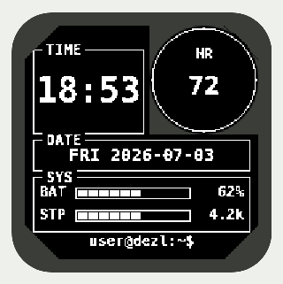

# tui-face

A clean, minimal TUI-inspired watchface for the **Garmin Instinct 2 dēzl Edition** (Connect IQ, Monkey C).



Boxed panels with labels knocked into the frame, terminal style. White-on-black, drawn entirely with 1-bit primitives — every pixel is pure black or white, which is exactly what the Instinct's 176×176 MIP panel displays.

## Layout

| Region       | Content                                                              |
| ------------ | -------------------------------------------------------------------- |
| `TIME` panel | hh:mm in the largest number font that fits; AM/PM chip in 12-h mode  |
| subscreen ◯  | `HR` label + current heart rate (`--` when no reading)               |
| `DATE` panel | `DOW YYYY-MM-DD`                                                      |
| `SYS` panel  | `BAT` and `STP` rows: label, 10-segment meter, value                  |
| footer       | `user@dezl:~$` prompt                                                 |

The circular subscreen geometry is read from `WatchUi.getSubscreen()` at runtime (with a hardcoded Instinct 2 fallback), so heart rate always lands inside the physical cutout. The face does one full redraw per minute — no high-power partial updates, easy on the battery.

## Data sources

- `System.getClockTime()` — time, honors the 12/24-hour device setting
- `Time.Gregorian.info(..., FORMAT_SHORT)` — weekday + ISO date
- `Activity.getActivityInfo().currentHeartRate`, falling back to the newest `ActivityMonitor.getHeartRateHistory` sample
- `System.getSystemStats().battery` — BAT meter
- `ActivityMonitor.getInfo()` — steps and step goal for the STP meter

All sensor values are null-guarded; missing readings render as `--`.

## Building

Requires the [Connect IQ SDK](https://developer.garmin.com/connect-iq/sdk/) (7.x or newer) with the **Instinct 2 dēzl** device installed via the SDK Manager.

```sh
# one-time: developer signing key
openssl genrsa -out key.pem 4096
openssl pkcs8 -topk8 -inform PEM -outform DER -in key.pem -out key.der -nocrypt

# build
monkeyc -d instinct2dezl -f monkey.jungle -o bin/tui-face.prg -y key.der

# run in the simulator
connectiq &
monkeydo bin/tui-face.prg instinct2dezl
```

Or open the folder in VS Code with the [Monkey C extension](https://marketplace.visualstudio.com/items?itemName=garmin.monkey-c) and use **Monkey C: Build/Run**.

### Sideloading

Copy `bin/tui-face.prg` to the watch's `GARMIN/APPS/` folder over USB, then pick the face via **Hold Menu → Watch Face** on the device.

## Notes

- This project was authored without access to the Connect IQ compiler (network-restricted environment), so it has not been compiled here. The code sticks to long-stable APIs; if `monkeyc` reports anything, it should be trivial to fix.
- If the compiler warns about the launcher icon size, resize `resources/drawables/launcher_icon.png` to the size it names for `instinct2dezl` (it rescales automatically either way).
